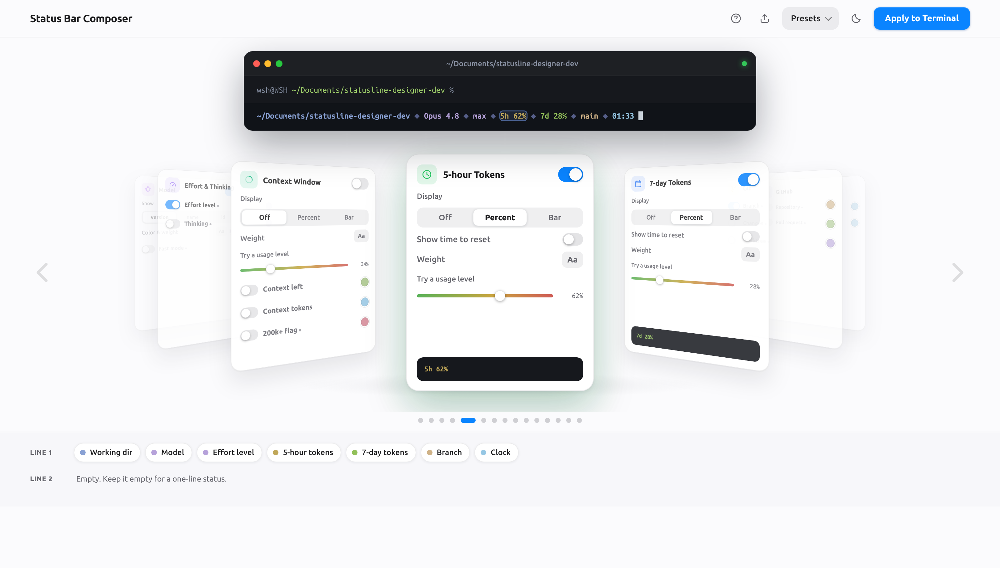
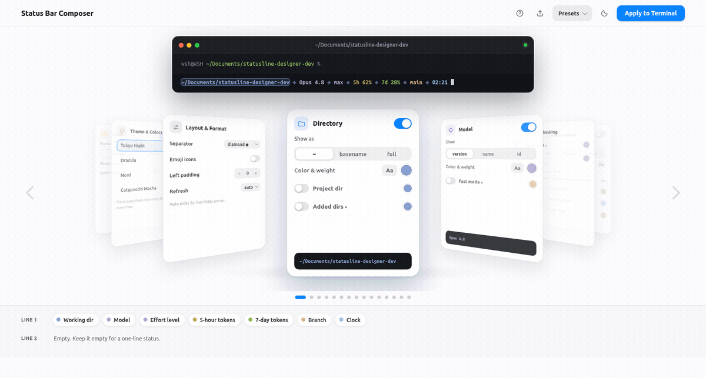

<h1 align="center">Status Bar Composer</h1>

<p align="center">
  Visually design your Claude Code terminal status line — a local, macOS-style
  web designer, shipped as a Claude Code skill.
</p>

<p align="center">
  
</p>

Arrange fields on a **3D card ring**, watch a **live terminal preview** update as you
go, then hit **Apply**: the skill generates a self-contained `python3` status-line
script and wires it into your `settings.json`. It runs entirely on your machine
(binds `127.0.0.1`) — no network requests, no build step.

## Demo

Rotate the ring, focus a card, toggle a field and watch the preview update live,
then flip between light and dark:

<p align="center">
  
</p>

## Features

- **3D property-card ring** — drag, swipe, arrow-key or click to focus a card.
- **Live terminal preview** — pixel-mirrors the generated script, so what you see is
  what your terminal gets.
- **Light & dark** themes, plus color palettes: Tokyo Night (default), Dracula, Nord,
  Catppuccin Mocha.
- **Starter presets** — Minimal, Essentials, Limits watch, Full telemetry, As pictured.
- **Every field Claude Code exposes** — model, working directory, git branch/changes,
  context-window %, 5-hour & 7-day usage limits, effort level, session cost, cumulative
  input/output/cache tokens, a live clock, and more.
- **Two-line arrangement dock** — drag chips to reorder fields or split across two lines.
- **Export** the design as JSON. **100% local** — vanilla HTML/CSS/JS served by a
  stdlib `python3` server; no external requests.

## Install & use

**As a Claude Code skill (recommended).** Copy the skill into your Claude Code skills
folder, then just ask for it:

```bash
git clone https://github.com/WSH95/statusline-designer-dev.git
cp -r statusline-designer-dev/statusline-designer ~/.claude/skills/statusline-designer
```

Then in Claude Code, say something like *"design my status line"* or *"show git branch
and context % in my status bar"*. The skill starts the designer, hands you the URL, and
on **Apply** generates the script and updates `settings.json` for you. Re-run it anytime
to tweak — it re-hydrates from your current layout.

**Run the designer directly.**

```bash
python3 statusline-designer/scripts/server.py
# open http://localhost:8765
```

## How it works

```
web UI  ──Apply──▶  choice.json
                        ├─ generate.py        ─▶  ~/.claude/statusline-command.py   (self-contained python3)
                        └─ apply_settings.py   ─▶  settings.json                     (adds the statusLine command)
```

`choice.json` is the contract between the UI and the generators; the status-line script
is pure `python3` (stdlib + `git`), null-safe, and degrades gracefully when a field's
data is absent.

## Development

This repo is the development home of the skill. The shippable, self-contained skill lives
in [`statusline-designer/`](statusline-designer/); everything else is dev tooling.

```
statusline-designer/       # the drop-in skill (SKILL.md + scripts/)
  scripts/server.py        # serves the composer UI
  scripts/ui/              # vanilla HTML/CSS/JS (ring, preview, dock)
  scripts/generate.py      # choice.json  ->  status-line script
  scripts/apply_settings.py# merges statusLine into settings.json
dev/verify.sh              # sandboxed end-to-end checks
docs/                      # README media
```

Run the sandboxed end-to-end suite (never touches your real `~/.claude`):

```bash
bash dev/verify.sh
```

## Requirements

`python3` (standard library only) and a browser. Cross-platform: macOS, Linux, Windows.
